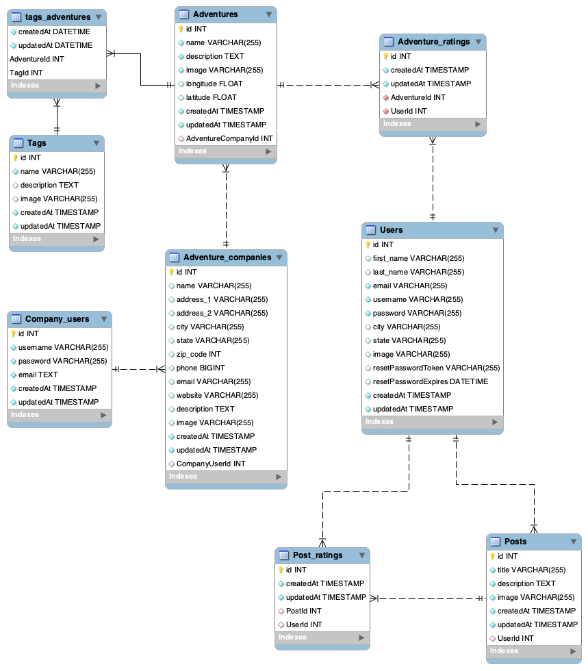

# Minnesvärt

## Description
Minnesvärt is a microadventure community providing short, simple, and local activity ideas to Washingtonians. At Minnesvärt we are selling the idea of access to the microadventure community. Adventure tour companies can use this application to post their activities. The user base will be able to retrieve that information, filter by tags, rate the adventure, and network within activity discussion. Stay wild, stay local, stay Minnesvärt.

Link to deployed application: http://minnesvart.herokuapp.com/

## **Table of Contents**

1. [Installation](#installation)
2. [Usage](#usage)
3. [License](#license)
4. [Framework](#framework)
5. [Contributors](#contributors)
6. [Wireframe](#wireframe)
7. [ERD](#erd)
8. [Tests](#tests)
9. [Questions](#questions)
10. [Visuals](#visuals)
11. [Links](#links)

## **Installation**

## **Usage**
As a User
As a company user
As an adventure company 

## **License**
Copyright (c) 2020, Minnesvärt. 

## **Frameworks**
Built with Material-UI

## **Contributors**

### **Front End:**

Mike Fallesen - Git Master https://github.com/mfallesen / mfallesen2010@gmail.com

Larry Cessna - https://github.com/lbcessna / larrybcessna@gmail.com

#### **Back End:**

Andrew Crow - Project Manager https://github.com/crowandrew / Andrew@crow.me

Dan Yoder - https://github.com/dyoder838 / dyoder838@gmail.com

Kayla Newlon - https://github.com/kbnewlon / kayla.b.newlon@gmail.com

## **Wireframe**

[Wireframe by Figma](https://www.figma.com/file/O7fe1y0SaEDsxI3PeEu51H/Untitled?node-id=0%3A1)

## **ERD**

## **Tests**

## **Questions**

## **Visuals**

## **Links**
 Backend Repo: https://github.com/kbnewlon/project3
 Frontend Repo: https://github.com/mfallesen/project3-frontend
 Deployed Application on Heroku: http://minnesvart.herokuapp.com/