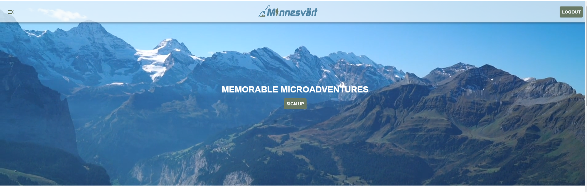
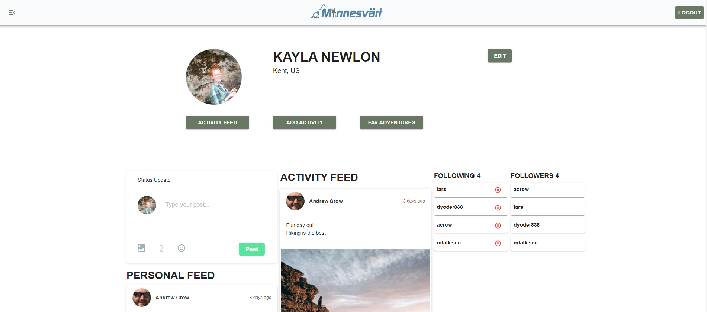
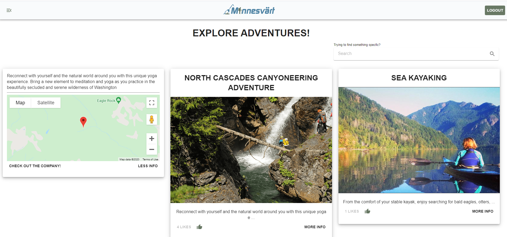
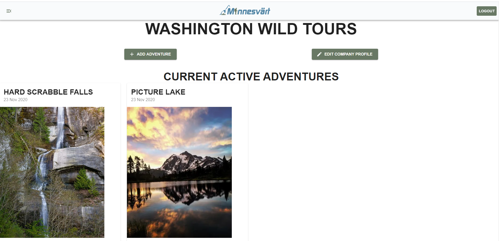

# Minnesvärt

 

## Description
Minnesvärt is a microadventure community providing short, simple, and local activity ideas to Washingtonians. At Minnesvärt we are selling the idea of access to the microadventure community. Adventure tour companies can use this application to post their activities. The user base will be able to retrieve that information, filter by tags, rate the adventure, and network within activity discussion. Stay wild, stay local, stay Minnesvärt.

Link to deployed application: https://minnesvart.herokuapp.com/

## **Table of Contents**

1. [Usage](#usage)
2. [License](#license)
3. [Framework](#framework)
4. [Contributors](#contributors)
5. [Wireframe](#wireframe)
6. [Technologies](#technologies)
7. [ERD](#erd)
8. [Questions](#questions)
9. [Visuals](#visuals)
10. [Demos](#demos)
11. [Links](#links)

## **Usage**
As a first time user click on the sign up button in the middle of the landing page. Create a username and password and click sign up. Once you've logged in click on the drawer on the left side of the page to navigate to your profile or adventures page. As a user you can edit your profile picture, add activities, post to your personal feed, and follow other users. 
  
As a first time company user scroll to the bottom of the landing page. In the footer you will see the option to login or sign up. Click sign up and enter in your company user login information. From the company user profile you can post adventures for users to favorite, as well as the contact information for your adventure company. 

## **License**
Copyright (c) 2020, Minnesvärt. 

## **Frameworks**
Built with Material-UI

## **Contributors**

### **Front End:**

Mike Fallesen - Git Master https://github.com/mfallesen / mfallesen2010@gmail.com

Larry Cessna - https://github.com/lbcessna / larrybcessna@gmail.com

#### **Back End:**

Andrew Crow - Project Manager https://github.com/crowandrew / Andrew@crow.me

Dan Yoder - https://github.com/dyoder838 / dyoder838@gmail.com

Kayla Newlon - https://github.com/kbnewlon / kayla.b.newlon@gmail.com

## **Wireframe**

[Wireframe by Figma](https://www.figma.com/file/O7fe1y0SaEDsxI3PeEu51H/Untitled?node-id=0%3A1)

## **Technologies**
* React.js
* JWT
* Bcrypt
* Node
* MySQL
* GetStream.io
* Helmet
* Moment
* Fuse.js
* Cloudinary
* Passport
* Google Maps

## **ERD**

## **Questions**
Contact our team at minnesvart@gmail.com for any questions 

## **Visuals**

## **Demos**
Adventure Company User Demo: https://youtu.be/0wrHZZjhLL4
 User Demo: https://youtu.be/moe7m-lB4CM 
 Mobile User Demo: https://youtu.be/Ycgiax4qU2k

## **Links**
Backend Repo: https://github.com/kbnewlon/project3
 Frontend Repo: https://github.com/mfallesen/project3-frontend
 Deployed Application on Heroku: https://minnesvart.herokuapp.com/